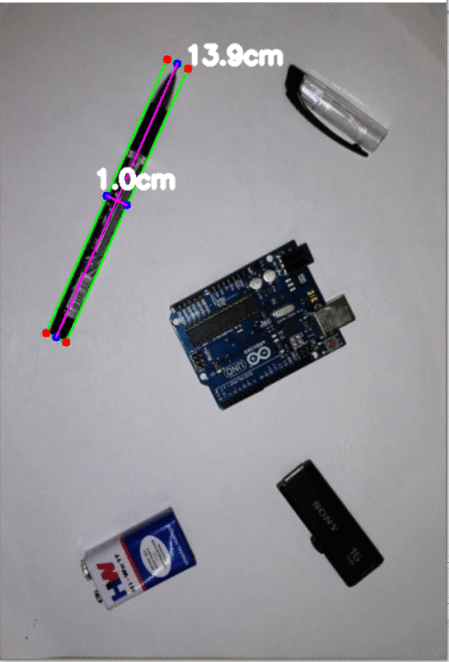

# object_size_measurement_openCV
Measure the dimension of objects placed on a A4 sheet

## Summary:

This repo contains code to measure size of objects placed on an A4 sized sheet using openCV.

It doesn't work if the objects are not on a A4 sheet because A4 sheet is considered as the reference to calculate dimensions of other objects.

The measurements are quite accurate with an error of +/- 0.5cm mostly due to parallax error caused while taking the image.

We can see the obtained results below:

